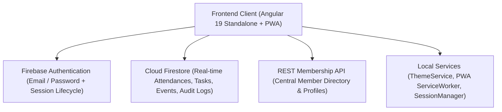
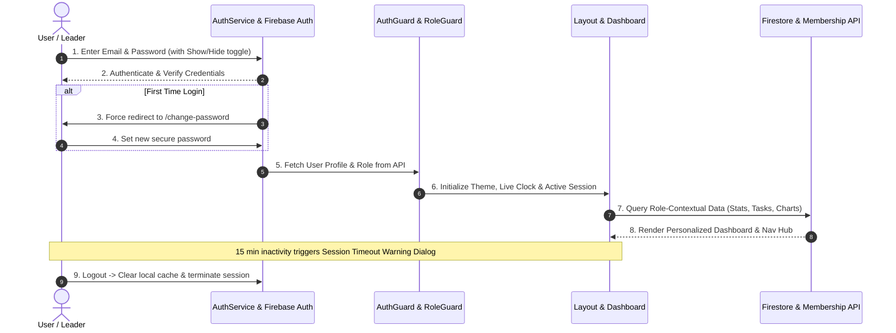
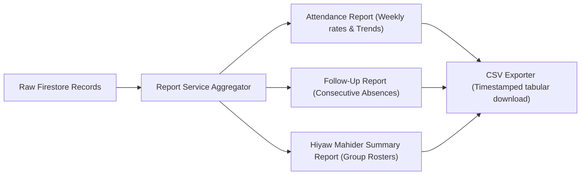

# SelahCMS — Complete System Architecture & Operational Guide
**Gerji Emmanuel United Church (ገ/ኢ አማኑኤል ኅብረት ቤተክርስቲያን)**

---

## 1. System Overview & Core Technology Stack

**SelahCMS** is a standalone, enterprise-grade church and fellowship management system custom-engineered for **Gerji Emmanuel United Church**. It powers fellowship tracking, small group discipleship (*Hiyaw Mahider*), pastoral care, zone coordination, task workflows, and attendance analytics.



### Key Technical Characteristics
* **Frontend Framework**: Angular 19 (Standalone Components, Signals, Reactive RxJS Observables).
* **UI/UX System**: Angular Material (MDC), custom design tokens, GPU-accelerated Skeleton Shimmer loaders, Dark/Light theme switching.
* **Authentication**: Firebase Authentication with 15-minute inactivity timeout, 120s countdown modal, and first-time forced password reset.
* **Data Sources**:
  * **Cloud Firestore**: Attendances, Tasks, Church Events, Audit Logs, Custom User Settings.
  * **REST Membership API**: Central member records, Hiyaw Mahider assignments, zone mapping.
* **Progressive Web App (PWA)**: Standalone installable mobile & desktop application with offline network-first service worker (`sw.js`).

---

## 2. Global Role Permissions Matrix (RBAC)

Access to every screen, action button, chart, and navigation link is governed by the centralized matrix in `src/app/core/utils/role.utils.ts`.

| Module / Operation | Admin | Pastor | Deputy Pastor | Zone Coordinator | Member |
| :--- | :---: | :---: | :---: | :---: | :---: |
| **Dashboard** | Full (Church-wide) | Cell Group View | Cell Group View | Zone View | Personal View |
| **Attendance Tracker** | ✅ All Groups | ✅ Assigned Group | ✅ Assigned Group | ✅ Zone Groups | ❌ *No Access* |
| **Attendance Breakdown Graph** | ✅ Aggregate | ✅ Aggregate | ✅ Aggregate | ✅ Aggregate | ✅ Personal History |
| **Bible Study Progress** | ✅ Full | ✅ Full | ✅ Full | ✅ Full | ✅ Personal Units |
| **Members Directory** | ✅ Church Roster | ✅ Cell Roster | ✅ Cell Roster | ✅ Zone Roster | ✅ Fellowship Roster |
| **Fellowship Tasks** | ✅ Create / Edit All | ✅ Create / Edit Cell | ✅ Create / Edit Cell | ✅ Create / Edit Zone | ✅ View Assigned |
| **Church Events** | ✅ Create / Edit | ✅ Create / Edit | ✅ Create / Edit | ✅ Create / Edit | ❌ *No Access* |
| **Hiyaw Mahider (Cell Groups)** | ✅ Full CRUD | ✅ Cell Overview | ✅ Cell Overview | ✅ Zone Groups | ❌ *No Access* |
| **Zone Management** | ✅ Full CRUD | ❌ *No Access* | ❌ *No Access* | ✅ Assigned Zone | ❌ *No Access* |
| **Pastors Directory** | ✅ Full CRUD | ❌ *No Access* | ❌ *No Access* | ❌ *No Access* | ❌ *No Access* |
| **Reports & CSV Analytics** | ✅ Full Church | ✅ Cell Reports | ✅ Cell Reports | ❌ *No Access* | ❌ *No Access* |
| **Audit & Activity Logs** | ✅ Security Logs | ❌ *No Access* | ❌ *No Access* | ❌ *No Access* | ❌ *No Access* |

---

## 3. End-to-End User Journey (A to Z)



### Step 1: Authentication & Security Controls
* **Login Form** (`/login`):
  * Supports email autofill (`autocomplete="username"`) and password autofill (`autocomplete="current-password"`).
  * **Password Visibility Toggle**: Interactive eye icon (`visibility` / `visibility_off`) with full WCAG aria-labels and keyboard support.
  * **First-Login Enforcement**: Users with `firstLogin: true` are intercepted by the router and routed directly to `/change-password` before accessing dashboard resources.
* **Password Reset** (`/forgot-password`):
  * Sends official password recovery email via Firebase Auth.
* **Active Session Inactivity Lifecycle**:
  * Monitors user interaction events (`mousemove`, `keydown`, `click`, `scroll`, `touchstart`).
  * At 13 minutes of inactivity, a **Session Warning Modal** appears with a live 120-second countdown.
  * Clicking **"Stay Logged In"** resets the timer; if countdown reaches zero, the user is safely logged out and redirected to `/login`.

### Step 2: Global Header & Application Shell
* **Header Controls**:
  * **Live Tabular Clock**: Accurate seconds ticking display (`HH:mm:ss`, `EEE, d MMM yyyy`).
  * **Theme Switcher**: ☀️ Light Mode / 🌙 Dark Mode toggle with instant CSS variable transformation and `localStorage` persistence.
  * **User Profile Pill**: Displays user avatar initials, user name, role tag, and dropdown menu (Profile, Change Password, Logout).
* **PWA Floating Install Banner**:
  * Automatically detects device readiness and displays a non-intrusive bottom install prompt with church crest logo.

---

## 4. Core Business Logics & Algorithms

### A. Attendance Tracking & Storage Logic
* **Data Structure (`attendances` collection in Firestore)**:
  ```typescript
  interface Attendance {
    id?: string;
    hiyawMahiderId: string;
    hiyawMahiderName: string;
    studyDay: string;          // e.g. "Wednesday", "Saturday"
    date: Date | Timestamp;
    members: {
      userId: string;          // Firebase UID or Membership UUID
      fullName: string;
      status: 'present' | 'absent' | 'excused' | 'late' | 'new-guest' | 'follow-up-needed';
      reason?: string;
    }[];
    createdAt: Date;
    updatedAt: Date;
  }
  ```
* **Status Classifications**:
  1. `present` (🟢 Green): Attended the fellowship on time.
  2. `late` (🟡 Yellow): Arrived after opening prayer/study start.
  3. `excused` (🔵 Blue): Notified leader in advance with valid reason.
  4. `absent` (🔴 Red): Missed meeting without prior notification.
  5. `new-guest` (🟣 Purple): First-time attendee visiting fellowship.
  6. `follow-up-needed` (🟠 Orange): Member flagged for pastoral care/home visit.

---

### B. Personal vs Fellowship Attendance Breakdown Logic
* **For `Member` Users**:
  * Queries attendances over a rolling 4-month window matching the member's `uid` or `memberId`.
  * The chart renders as **"My Attendance Breakdown"** showing the member's individual attendance distribution.
* **For Leadership (`Admin`, `Pastor`, `Deputy Pastor`, `Zone Coordinator`)**:
  * Queries attendances across all members in the assigned Hiyaw Mahider or Zone.
  * The chart renders as **"Attendance Breakdown"** (*"Fellowship participation analytics"*).

---

### C. Bible Study Progress & "Days Active" Algorithm
The Bible Study Progress metric measures active discipleship participation over a **rolling 90-day (3-month) evaluation window**:

$$\text{Progress Percentage} = \left( \frac{\text{Present Opportunities}}{\text{Total Available Sessions}} \right) \times 100\%$$

* **Algorithm Step-by-Step**:
  1. Filter all attendance records where $\text{Record Date} \ge (\text{Today} - 90 \text{ days})$.
  2. Identify all sessions where the member was rostered ($\text{Total Opportunities}$).
  3. Count all sessions where member status $\in \{\text{'present'}, \text{'late'}, \text{'new-guest'}\}$ ($\text{Present Count}$).
  4. Compute unique meeting dates attended to derive **"Days Active"**.
  5. If $\text{Total Opportunities} = 0$, progress defaults to $0\%$.

---

### D. Task Management & Board Logic
* **Contextual Task Filtering**:
  * **Admins & Pastors**: See all tasks created across church/fellowships.
  * **Zone Coordinators**: See tasks within their geographic zone.
  * **Members**: See tasks assigned directly to them or designated for their specific Hiyaw Mahider.
* **Display Filtering on Dashboard**:
  * Active tasks with $\text{status} \in \{\text{'pending'}, \text{'in_progress'}\}$.
  * Sort order: ascending by `dueDate` (urgent items first).

---

### E. Events Management Logic
* **Church-Level Exclusivity**:
  * Events represent church-wide conferences, retreats, and special worship services (not small group meetings).
  * **Visibility**: Exclusively available to `Admin`, `Pastor`, `Deputy Pastor`, and `Zone Coordinator`.
  * **Hidden for Members**: Member navigation, stat cards, and widgets exclude events to keep focus on fellowship study and discipleship tasks.

---

## 5. Reports & Analytics Engine



### Report Types Available
1. **Attendance Report (`/reports/attendance`)**:
   * Filter by Zone, Hiyaw Mahider, Date Range, and Study Day.
   * Calculates overall attendance percentage and status distribution.
2. **Follow-Up Report (`/reports/follow-up`)**:
   * Isolates members with 2+ consecutive absences or flagged as `follow-up-needed`.
   * Displays last contact date, member phone number, and pastoral notes.
3. **Hiyaw Mahider Summary Report (`/reports/hiyaw-mahider`)**:
   * Provides high-level fellowship health metrics, leader assignments, and meeting locations.
4. **CSV Export Engine**:
   * Generates standard RFC 4180 CSV exports for offline office processing and church leadership reviews.

---

## 6. Security, Compliance & Audit Trail

* **Audit Logging System** (`src/app/core/services/audit-log.service.ts`):
  * Automatically records sensitive actions in the `audit_logs` collection:
    * `AUTH_LOGIN` / `AUTH_LOGOUT`
    * `ATTENDANCE_RECORD` / `ATTENDANCE_UPDATE`
    * `MEMBER_CREATE` / `MEMBER_UPDATE`
    * `PASSWORD_CHANGE`
* **Accessibility (WCAG 2.1 Level AA)**:
  * High-contrast color ratios in both Dark (`#0b1320` / `#131f33`) and Light (`#f8fafc` / `#ffffff`) modes.
  * Keyboard navigation throughout all menus, inputs, dialogs, and tables.
  * Screen-reader ARIA live regions and attributes (`aria-label`, `aria-pressed`, `aria-expanded`).
