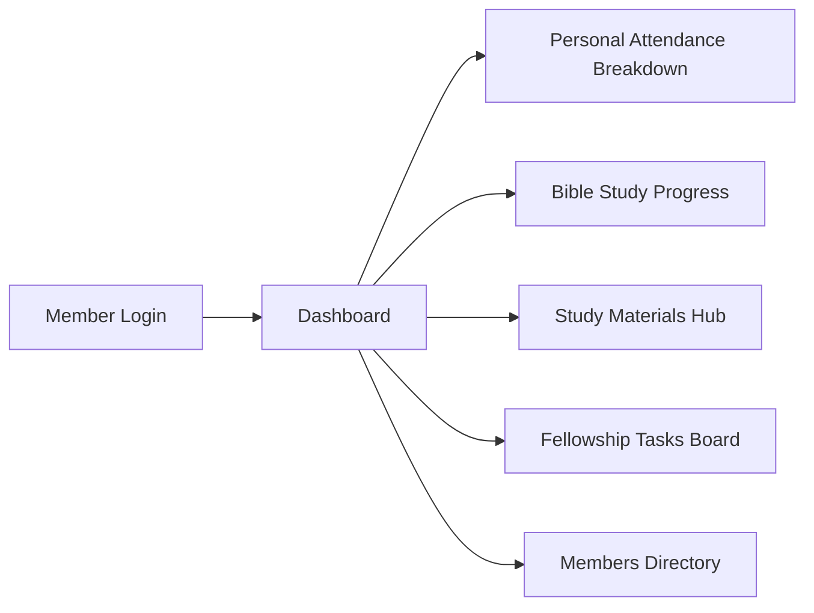

# SelahCMS — End-User Operations Manual & How-To Guide
**Gerji Emmanuel United Church (ገ/ኢ አማኑኤል ኅብረት ቤተክርስቲያን)**

Welcome to **SelahCMS**! This user-friendly guide explains step-by-step how to use the portal for your daily fellowship activities, Bible studies, attendance tracking, and church management.

---

## 📖 Quick Navigation by Role
* [Part 1: General Features for All Users](#part-1-general-features-for-all-users)
* [Part 2: How to Use SelahCMS as a **Member**](#part-2-how-to-use-selahcms-as-a-member)
* [Part 3: How to Use SelahCMS as a **Fellowship Leader / Pastor**](#part-3-how-to-use-selahcms-as-a-fellowship-leader--pastor)
* [Part 4: How to Use SelahCMS as a **Zone Coordinator**](#part-4-how-to-use-selahcms-as-a-zone-coordinator)
* [Part 5: How to Use SelahCMS as an **Administrator**](#part-5-how-to-use-selahcms-as-an-administrator)
* [Part 6: Frequently Asked Questions & Troubleshooting](#part-6-frequently-asked-questions--troubleshooting)

---

## Part 1: General Features for All Users

### 1. How to Log In
1. Go to the login page: `http://localhost:4200/login`.
2. Type your registered **Email Address** and **Password**.
3. *Tip*: Click the **eye icon** (👁️) inside the password box to reveal/hide your password as you type.
4. Click the **Login** button.
5. If this is your very first login, the system will automatically prompt you to set a new personal password before opening your dashboard.

### 2. How to Switch Between Dark and Light Modes
* Look at the **top right corner** of the screen (next to the live clock).
* Click the **☀️ / 🌙 Theme Toggle Button**:
  * **Light Mode (☀️)**: Clean white daylight background, ideal for bright rooms.
  * **Dark Mode (🌙)**: Relaxing deep navy/teal background, easy on the eyes in low light.
* Your selection is saved automatically on your device!

### 3. How to Install SelahCMS on Your Phone or Desktop (PWA)
* **On Android Phone (Chrome)**:
  * Open SelahCMS in Chrome $\rightarrow$ Tap the floating **"Install SelahCMS"** banner at the bottom $\rightarrow$ Tap **Install**.
  * The church crest icon will appear on your phone home screen like a native app.
* **On iPhone / iPad (Safari)**:
  * Open SelahCMS in Safari $\rightarrow$ Tap the **Share button** (square with up-arrow) $\rightarrow$ Scroll down and tap **"Add to Home Screen"**.
* **On Laptop / PC (Chrome or Edge)**:
  * Click the **Install** icon on the right side of the web address bar (or click **Install** in the bottom banner).

### 4. Automatic Session Security & Logout
* For security, if you leave the screen idle for **13 minutes**, a warning modal will pop up with a 120-second countdown.
* Click **"Stay Logged In"** to continue working.
* If you step away and the timer expires (15 minutes total), the system automatically logs out safely.
* To log out manually: Click your **Avatar / Name** on the top right $\rightarrow$ Click **Logout** (or click Logout at the bottom of the left sidebar).

---

## Part 2: How to Use SelahCMS as a **Member**

As a church member, SelahCMS is your central hub for discipleship, study curriculum, and fellowship tasks.

### 1. Understanding Your Dashboard
When you log in, your personalized dashboard displays:
* **Welcome Banner**: Shows your name and your assigned **Hiyaw Mahider (Cell Group)**.
* **Active Tasks Card**: Shows pending fellowship duties or prayer assignments.
* **Study Progress Card**: Shows your percentage of completed discipleship units.
* **"My Attendance Breakdown" Graph**: Displays a color-coded doughnut chart of your personal attendance history:
  * 🟢 **Present**: Meetings you attended.
  * 🟡 **Late**: Meetings attended after start.
  * 🔵 **Excused**: Meetings you notified your leader in advance.
  * 🔴 **Absent**: Missed sessions.
  * 🟣 **New Guest**: Initial visitor session.

### 2. How to Access Study Materials
1. From the left sidebar (or the **Navigation Hub** on your dashboard), click **Study Materials** (📖).
2. Browse through the available weekly Bible curriculum lessons.
3. Click on any lesson title to read the study text, scriptures, discussion questions, and prayer points.

### 3. How to View and Manage Assigned Tasks
1. In the sidebar, click **Tasks** (📋).
2. Review tasks assigned to you (e.g. *"Host opening prayer this week"*, *"Contact new visitor"*).
3. View the task **Due Date**, **Priority** (High/Medium/Low), and **Description**.
4. Once you have completed the assignment, you can mark the task as **Completed**.

### 4. How to Use the Members Directory
1. Click **Members** (👥) in the sidebar.
2. Search for your fellow cell group members by name.
3. Use the quick **Call** (📞) or **Email** (✉️) buttons to stay connected and encourage one another during the week.

---

## Part 3: How to Use SelahCMS as a **Fellowship Leader / Pastor**

As a Hiyaw Mahider Leader or Pastor, you manage weekly meetings, take attendance, track discipleship progress, and coordinate care follow-ups.

### 1. How to Record Weekly Fellowship Attendance
1. In the sidebar, click **Attendance** (✅).
2. Select your **Hiyaw Mahider** and the **Meeting Date** (e.g. Wednesday study).
3. The system will load your complete group member roster.
4. For each member, click their status button:
   * **Present (P)** — Member is present.
   * **Late (L)** — Member arrived late.
   * **Excused (E)** — Member asked for permission in advance.
   * **Absent (A)** — Member did not attend.
   * **New Guest (G)** — First-time attendee.
   * **Follow-up Needed (F)** — Member needs pastoral visit / phone call.
5. *(Optional)* Type a note or reason for absence in the comment box.
6. Click **Save Attendance Record**. The attendance chart and discipleship analytics update immediately!

### 2. How to Create and Assign Fellowship Tasks
1. On your dashboard, click the **+ New Task** button on the hero banner (or navigate to **Tasks** $\rightarrow$ click **+ Create Task**).
2. Enter the **Task Title** (e.g. *"Organize Refreshments for Saturday Study"*).
3. Select the **Assigned Member** or leave for the entire cell group.
4. Set the **Due Date** and **Priority** (Low, Medium, High, Urgent).
5. Enter instructions in the **Description** box.
6. Click **Save Task**. The assigned member will immediately see it on their dashboard.

### 3. How to View Fellowship Reports & Identify Absentees
1. In the sidebar, click **Insights / Reports** $\rightarrow$ **Attendance Report**.
2. Filter by your Hiyaw Mahider and date range (e.g. Last 30 days).
3. Review:
   * Overall attendance rate.
   * Weekly attendance trend graph.
   * Members who missed 2 or more consecutive meetings.
4. Click **Export to CSV** if you need a spreadsheet copy for leadership meetings.

---

## Part 4: How to Use SelahCMS as a **Zone Coordinator**

Zone Coordinators oversee all Hiyaw Mahiders (cell groups) located within their designated geographic zone.

### 1. Zone Management Overview
1. In the sidebar under **Administration**, click **Zones** (📍).
2. View all cell groups active in your zone, their physical meeting locations, and their designated group leaders.
3. Review total member numbers and contact details for cell leaders.

### 2. Zone-Wide Attendance Monitoring
1. In the sidebar, click **Attendance** (✅).
2. You can switch between any Hiyaw Mahider in your zone to inspect meeting records.
3. Verify that all cell leaders have submitted their weekly attendance sheets on time.

### 3. Coordinating Zone Tasks
1. Go to **Tasks** (📋).
2. Create zone-level action items for cell leaders (e.g. *"Quarterly Zone Prayer Night Planning"*).
3. Track completion progress across all cell leaders in your zone.

---

## Part 5: How to Use SelahCMS as an **Administrator**

Administrators have comprehensive, church-wide access to manage church structure, pastoral staff, zones, security logs, and official exports.

### 1. Managing Zones & Hiyaw Mahiders
* **Create a New Zone**: Go to **Zones** $\rightarrow$ Click **+ Add Zone** $\rightarrow$ Enter Zone Name, Code, and assign the Zone Coordinator.
* **Create a New Hiyaw Mahider**: Go to **Hiyaw Mahider** $\rightarrow$ Click **+ Add Fellowship Group** $\rightarrow$ Enter Group Name, assigned Zone, meeting day/time, home address, and assign the Leader and Deputy Leader.

### 2. Managing Pastors & Ministry Leaders
* Go to **Pastors** in the sidebar.
* View assigned pastoral oversight across all zones and fellowships.
* Add or update pastoral contact information and ministry designations.

### 3. Generating Church-Wide Reports
* Go to **Reports** in the sidebar:
  * **Attendance Report**: Church-wide and cell-level attendance analytics with instant CSV downloads.
  * **Hiyaw Mahider Report**: Health metrics, active sizes, and member growth per fellowship.
  * **Follow-Up Report**: Comprehensive listing of all members church-wide flagged for pastoral care.

### 4. Viewing Activity & Security Logs
* Under **Administration**, click **Activity Logs** (🛡️).
* Inspect timestamped records of user logins, attendance submissions, password modifications, and roster updates.
* Provides full transparency, compliance, and security oversight.

---

## Part 6: Frequently Asked Questions & Troubleshooting

### Q1: What should I do if I forget my password?
* On the login page, click **Forgot Password?** (or go to `/forgot-password`).
* Enter your email address and click **Send Reset Link**.
* Check your email inbox for the reset link from Firebase/SelahCMS.

### Q2: Why is the screen showing a session warning?
* If your computer or phone has been inactive for 13 minutes, the security timer asks you to confirm you are still there.
* Simply click the green **Stay Logged In** button to continue your work without interruption.

### Q3: Why can't members see the Church Events menu?
* In SelahCMS, **Events** represent major church-wide leadership programs, retreats, and special conferences organized by the church administration.
* Members focus directly on their weekly Hiyaw Mahider fellowship, Bible study materials, and assigned discipleship tasks.

### Q4: Can I use SelahCMS when my internet connection is slow or offline?
* Yes! Thanks to the **PWA Service Worker**, SelahCMS caches essential interface screens and study materials so you can open the app and view your dashboard even with intermittent internet connectivity.
